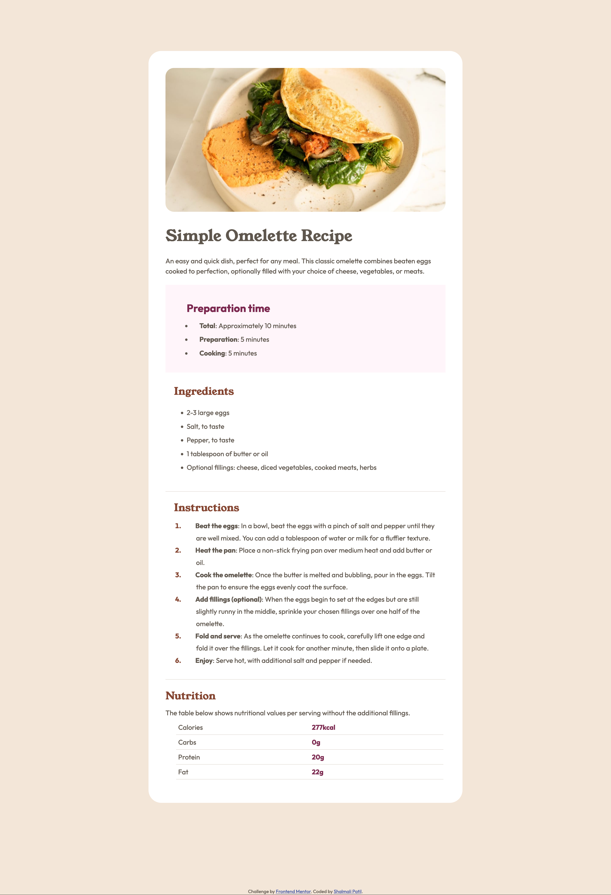

# Frontend Mentor - Recipe page solution

This is a solution to the [Recipe page challenge on Frontend Mentor](https://www.frontendmentor.io/challenges/recipe-page-KiTsR8QQKm). Frontend Mentor challenges help you improve your coding skills by building realistic projects. 

## Table of contents

- [Overview](#overview)
  - [The challenge](#the-challenge)
  - [Screenshot](#screenshot)
  - [Links](#links)
- [My process](#my-process)
  - [Built with](#built-with)
  - [What I learned](#what-i-learned)
  - [Continued development](#continued-development)

**Note: Delete this note and update the table of contents based on what sections you keep.**

## Overview

### Screenshot



### Links
- Live Site URL: (https://shalmali-patil.github.io/recipe-page-main/)

## My process

### Built with

- Semantic HTML5 markup
- CSS custom properties
- Flexbox


### What I learned

Used Flexbox to align the vertical components.
Used font-face to import the font files.
Aligning the text in the list under Instructions section took some time. Here is the HTML & CSS I used for this:

```html
<div id="instructions" class="item">
      <h2>Instructions</h2>
      <ul>
        <li><span class="li-text"><span class="bold">Beat the eggs</span>: In a bowl, beat the eggs with a pinch of salt and pepper until they are well mixed. 
          You can add a tablespoon of water or milk for a fluffier texture.</span></li>
        <li><span class="li-text"><span class="bold">Heat the pan</span>: Place a non-stick frying pan over medium heat and add butter or oil.</span></li>
        <li><span class="li-text"><span class="bold">Cook the omelette</span>: Once the butter is melted and bubbling, pour in the eggs. Tilt the pan to ensure 
          the eggs evenly coat the surface.</span></li>
        <li><span class="li-text"><span class="bold">Add fillings (optional)</span>: When the eggs begin to set at the edges but are still slightly runny in the 
          middle, sprinkle your chosen fillings over one half of the omelette.</span></li>
        <li><span class="li-text"><span class="bold">Fold and serve</span>: As the omelette continues to cook, carefully lift one edge and fold it over the 
          fillings. Let it cook for another minute, then slide it onto a plate.</span></li>
        <li><span class="li-text"><span class="bold">Enjoy</span>: Serve hot, with additional salt and pepper if needed.</span></li>
      </ul>
    </div>
```

```css
.bold {
    font-weight: bold;
    margin-left:20px;
}

#instructions ul{
    list-style: decimal;
    padding-left: 20px;
}

#instructions li {
    padding-left:2em;
    line-height: 1.8;
}

#instructions li::marker{
    color:hsl(14, 45%, 36%);
    font-weight: bold;
}
```

### Continued development

I used Pixel Perfect Pro browser extension to match the given design. However, there is scope for improvement here.
